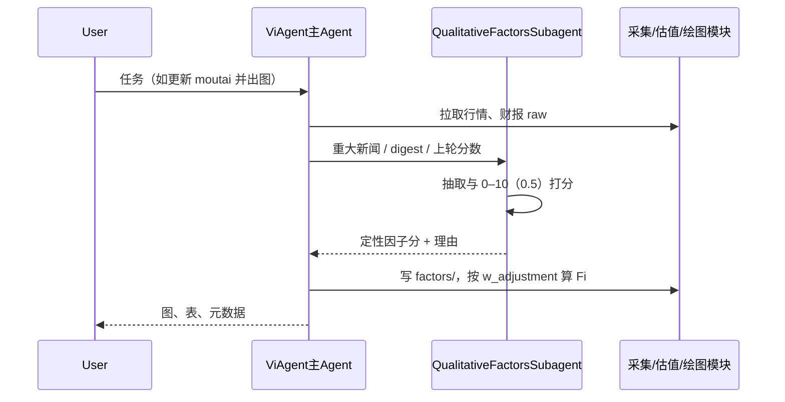

# Value Investment Agent — 设计文档（草案）

> **版本**：0.2 草案  
> **关联**：`docs/REQUIREMENTS.md`、`docs/architecture.md`  
> **说明**：描述因子全局表、个股配置、全局指标参数表、双 Agent 职责、数据流与实现落点；与 research proposal 的细节差异以评审后修订为准。

---

## 1. 架构对齐

```
data/macro/raw/                       # 宏观原始抓取（与个股 data 并列）
data/{symbol}/raw/{trading, financials, news, ...}/
factors/macro/series/                 # 宏观因子 TS（多由 data/macro/raw 清洗得到）
factors/{symbol}/{quantitative, qualitative, momentum, risk_premium}/
value_investment_agent/{config, ingestion, factor_pipeline, valuation, synthesis, models, vi_agent, moutai_experiment, ...}
```

- **Slug**：`cola`、`moutai`、`txrh`；Yahoo/SEC 映射仅在 `config/symbols.py`。  
- **仅两个 Agent**（与需求 §3.6 一致）：  
  - **ViAgent（主）**：编排、多轮交互、调用子 Agent 与各类 **代码模块**。  
  - **Qualitative Factors Subagent**：仅负责定性因子与重大新闻驱动的 **打分/更新**（0–10，步长 0.5）。  
- **moutai 实验**：`moutai_experiment/` — 净利润 → 双 Fi → 四线图表；尚未接入完整 registry / 全局参数表 / 双轨权重，为 **过渡实现**（见 §8）。

---

## 2. 因子系统设计

### 2.1 概念模型

| 概念 | 说明 |
|------|------|
| **全局因子注册表（Factor Registry）** | 全市场共用：定量、定性两类；每条有稳定 `factor_id`、类型、定义、数据类型、默认频率、元数据。 **版本化**，可增删改。 |
| **个股因子配置（Symbol Factor Profile）** | 每个 `symbol`：从注册表中 **挑选子集**，每个启用因子具备 **双轨权重**：`w_initial`（人工先验，训练期 **冻结**）、`w_adjustment`（可训练；**Fi 数值计算仅使用此项**，见 §2.3）。 |
| **因子取值实例** | 某时点或某段上的实际数值或分数；定性分数 **0–10、步长 0.5**；落盘在 `factors/{symbol}/...`。**宏观序列**仅落 `factors/macro/series/`，不按 symbol 复制。 |

**关系**：`Registry` 定义「世界上有哪些因子」；`Profile` 定义「这只股票启用哪些、训练用调整权重是多少」；`w_initial` 用于先验与审计，**不进入 Fi 前向公式**（需求 FR-FACTOR-6）。

### 2.2 注册表存储（建议）

**已实现（机读）**：**`config/fundamental_factors.json`** — 合并 **定量 + 定性** 全局池（`schema_version` 字段）；**`config/global_metrics.json`** — D/E、FCF 等 **variant** 与开关。说明见 **`config/README.md`**。

可选扩展（未强制）：若池子极大，可再拆为 `config/factors/registry_*.yaml`；或与下方 **YAML** 草案并存，以代码加载器实际路径为准。

```
config/factors/          # 可选拆分
  registry_quantitative_v1.yaml
  registry_qualitative_v1.yaml
  CHANGELOG.md
```

**每条记录建议字段**：

| 字段 | 含义 |
|------|------|
| `factor_id` | 蛇形，全局唯一 |
| `display_name_en` / `display_name_zh` | 展示名 |
| `description` | 业务定义与报表对应关系 |
| `value_type` | `currency` / `ratio` / `count` / `score` / … |
| `score_scale` | 定性因子：**`min: 0, max: 10, step: 0.5`** |
| `typical_frequency` | `daily` / `quarterly` / `annual` / `point_in_time` |
| `formula_ref` | 可选：指向 **全局参数表** 中的 `metric_id` + `variant_id` |
| `aliases` | 可选：同义词 |
| `since_version` | 引入该定义的注册表版本 |

**版本策略**：`v1` → `v2` 可 **并存**；旧文件只读，新实验用新 registry。

**发布流程（工程外）**：当前 **无强制评审流程**；默认由维护者直接改 YAML。若将来需要与回测绑定，可在 `run_meta.json` 记录 **registry 文件哈希 + 全局参数表版本**（§6、需求 §7）。

### 2.3 个股配置存储（建议）— 双轨权重

```
config/factors/profiles/
  moutai.yaml
  cola.yaml
  txrh.yaml
```

**示例结构（逻辑示意）**：

```yaml
symbol: moutai
registry_quant: registry_quantitative_v1
registry_qual: registry_qualitative_v1
factors:
  - id: net_income
    enabled: true
    w_initial: 1.0
    w_adjustment: 0.15
  - id: free_cash_flow
    enabled: true
    w_initial: 0.8
    w_adjustment: 0.0
  - id: pricing_power
    enabled: true
    w_initial: 1.2
    w_adjustment: 0.3
  - id: market_potential
    enabled: false
```

**语义**：

- **`w_initial`**：人工先验；训练循环 **不更新** 该字段（可改文件视为新实验，非梯度更新）。  
- **`w_adjustment`**：训练可更新；**Fi 合成、调制核参数时使用的权重张量仅读取 `w_adjustment`**（与需求 FR-FACTOR-6 一致）。  
- **训练目标**：损失对 `w_adjustment` 求导；`w_initial` 可作为 **正则锚点**（例如令 `w_adjustment` 不要偏离先验过多）——属实现细节，须在训练脚本中显式写出。  
- **迁移注意**：现有 `moutai_experiment/qual_four.py` 为 0–20 与单一 `modulation_index`；迁移后改为 **0–10 / 0.5 步长**，且调制输入为 **profile 中定性因子的 `w_adjustment` 加权聚合**（具体聚合式在 `synthesis/` 或 `valuation/` 中单点实现）。

### 2.4 与代码模块的映射

| 模块 | 职责 |
|------|------|
| `config/` | `symbols`、**`global_metrics.json`**（§3.1）、`fundamental_factors.json`、macro 配置、因子 profiles |
| `vi_agent/`（主 Agent） | 编排；调用子 Agent；**不**内嵌长文本定性逻辑 |
| `agents/` 中 **Qualitative Factors Subagent**（或独立包名，待代码落地） | 输入：新闻/digest/用户上下文；输出：定性 `factor_id → score` |
| `factor_pipeline/` | LLM 客户端、启发式；可被 Subagent 调用 |
| `ingestion/` | 按 `metric_id` + **全局参数表 variant** 计算定量序列 |
| `valuation/` | DCF 等核；读 **已解析** 的 FCF、D/E 等 |
| `synthesis/` | Parameter Synthesizer（全量）；读取 `w_adjustment` 与因子分数 |

---

## 3. 全局可配置参数表（指标定义与版本开关）

### 3.1 文件位置与职责

建议使用 **`config/global_metrics.json`**（或 **`config/global_metrics.yaml`**）（或 `config/engineering_constants.yaml`），与因子注册表 **并列**，负责：

1. **财务指标多定义（variant）**：如 `debt_to_equity`、`free_cash_flow` 的分子分母公式、合并口径、期末 vs 平均。  
2. **默认值**：`default_variant_id`，系统运行与回测默认采用；切换 variant 时写入 **run 元数据**。  
3. **可扩展开关**：如 `compute_fm: false`（本版本不算 Fm）、`compute_risk_premium: true` 等。

**示例（节选，非最终实现）**：

```yaml
version: "2026-04-04"
defaults:
  debt_to_equity_variant: "total_debt_to_book_equity"
  free_cash_flow_variant: "fcfe"
features:
  compute_fm: false
  compute_fm_note: "本版本关闭 Fm，仅 Fi + 因子管线"

metrics:
  debt_to_equity:
    default_variant_id: "total_debt_to_book_equity"
    variants:
      total_debt_to_book_equity:
        description: "Total debt / Book value of equity (期末)"
        numerator: "total_debt"
        denominator: "total_stockholder_equity"
        statement_scope: "consolidated"
      total_liabilities_to_equity:
        description: "Total liabilities / Equity（非标准 D/E，仅备选）"
        numerator: "total_liabilities"
        denominator: "total_stockholder_equity"
        statement_scope: "consolidated"

  free_cash_flow:
    default_variant_id: "fcfe"
    variants:
      fcfe:
        description: "股权自由现金流（简化）"
        formula_id: "cfc_from_cashflow_stmt"
      fcff:
        description: "企业自由现金流"
        formula_id: "fcff_from_cashflow_stmt"
```

**实现要点**：`ingestion` 与 `valuation` **只认** `metric_id + resolved_variant`，不在多处硬编码公式字符串。

### 3.2 与因子注册表的交叉引用

- `registry_quantitative_v1.yaml` 中 `debt_to_equity` 的 `formula_ref` 可写 `metrics.debt_to_equity`；运行时 **解析为** `global_metrics.json` 中当前 `default_variant_id` 对应的公式。  
- 变更默认 variant 即变更全系统口径，须在 **CHANGELOG** 或提交说明中记录。

---

## 4. 双 Agent 交互（逻辑）



**重大新闻**：由主 Agent 检测或用户显式触发后，将 **增量上下文** 交给 Qualitative Factors Subagent，**仅**更新定性侧输出；主 Agent 再触发 Fi 重算。

---

## 5. 数据流（moutai 四线为例）

区分 **采集**、**计算**、**全局参数表**、**双轨权重**。

```
[采集] 季度净利润序列  ← 本地 CSV 或 Yahoo 财报
[采集] 日线收盘价      ← Yahoo history（或 synthetic）
[采集] news_digest     ← 人工维护；可选 Yahoo 标题追加
[采集] 股本、债务、现金 ← Yahoo info + 季报资产负债表

[全局配置] global_metrics.json → D/E、FCF 的 variant 与默认
[全局配置] registry + profile → w_adjustment（Fi 用）

[子 Agent] 定性 0–10（0.5）→ factors/{symbol}/qualitative/
[计算] TTM、YoY、DCF 输入（FCF 口径来自 variant）
[计算] Fi：加权使用 w_adjustment（定性侧 + 定量侧按设计接入后）

[输出] moutai_dashboard.png
```

---

## 6. 回测与复现（绑定项）

建议在每次 run 写入 `run_meta.json`：

- `registry_quantitative` 文件路径与 **SHA256**  
- `registry_qualitative` 文件路径与 **SHA256**  
- `global_metrics.json` 的 **schema_version** 字段与文件哈希  
- `profile`（`moutai.yaml`）哈希  
- `debt_to_equity_variant`、`free_cash_flow_variant` **实际解析值**

**注册表发布流程**：不设强制门禁；依赖 **Git 历史 + 上述元数据** 做事后追溯。

---

## 7. LLM 解析策略

实现见 `factor_pipeline/llm_provider.py`：

- `GEMINI_API_KEY` 或 `GOOGLE_API_KEY` → 优先 Gemini（`auto` 时）。  
- 否则 `OPENAI_API_KEY` → OpenAI。  
- 否则与 `mock` 类似，走启发式（如 digest 关键词）。

**Qualitative Factors Subagent** 的 system prompt 须 **固定量纲**：每个定性因子 **0–10，步长 0.5**，输出 JSON schema 校验。

---

## 8. 全量系统 vs moutai 简化路径

| 能力 | 全量（proposal 方向） | moutai 实验（当前） |
|------|------------------------|---------------------|
| Parameter Synthesizer | 有 | 无（规则调制 growth/WACC） |
| 全局因子注册表 + profile | 本文档要求 | 待实现；定性硬编码四项 |
| 定性量纲 0–10（0.5） | 需求已定义 | 仍为 0–20 与 `modulation_index` |
| 双轨权重 `w_initial` / `w_adjustment` | 需求已定义 | 未实现 |
| `global_metrics.json` | 需求已定义 | 初稿已入库，加载器待接代码 |
| 双 Agent | 需求已定义 | 逻辑在 `factor_pipeline`，未拆 Subagent 边界 |
| Fm 网络 | `models/` + `training/` | **可由全局表 `compute_fm: false` 关闭** |

**迁移路径**：`global_metrics.json` + `fundamental_factors.json` + profile 双轨权重 → 重写 moutai 调制为 **w_adjustment × 归一化定性分数** → 拆 **Qualitative Factors Subagent** 接口 → 全量 Synthesizer。

---

## 9. 待实现清单（工程）

- [ ] `config/global_metrics.yaml` schema（Pydantic）与加载器  
- [ ] `config/factors/registry_*.yaml` 与定性 `score_scale`  
- [ ] `config/factors/profiles/*.yaml`：`w_initial` / `w_adjustment`  
- [ ] Fi 入口 **只读** `w_adjustment`  
- [ ] `qual_four` / moutai：**0–10、步长 0.5** 与 Subagent 输出对齐  
- [ ] `run_meta.json` 绑定 registry + global_metrics + profile 哈希  
- [ ] Qualitative Factors Subagent 模块边界与主 Agent 调用约定  

---

## 10. 文档修订记录

| 日期 | 版本 | 说明 |
|------|------|------|
| 2026-04-04 | 0.1 | 初稿：因子注册表、个股 profile、存储约定、moutai 数据流、与架构对齐 |
| 2026-04-04 | 0.2 | 0–10（0.5）量纲；双轨权重与 Fi；`global_metrics.yaml`；双 Agent；注册表流程暂缓；`compute_fm` 扩展开关示例 |
